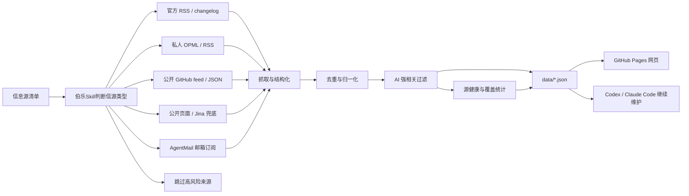

<div align="center">

# AI News Radar

## 24 小时 AI 更新雷达｜伯乐Skill

**伯乐Skill（Scout Skill）帮你从一堆信源里选出千里马。**

[](https://learnprompt.github.io/ai-news-radar/)
[](https://github.com/LearnPrompt/ai-news-radar/actions/workflows/update-news.yml)
[](LICENSE)

[在线页面](https://learnprompt.github.io/ai-news-radar/) · [English](README.en.md) · [伯乐Skill](skills/ai-news-radar/README.md) · [信息源策略](docs/SOURCE_COVERAGE.md)

</div>

---

## 这是什么

AI News Radar 是一个自动更新的 24 小时 AI 更新雷达。

普通用户直接打开网页，看最近 24 小时 AI、模型、开发者工具和技术生态更新。维护者可以 fork 这个仓库，接入自己的 OPML/RSS、公开 feed、静态页面或 AgentMail 邮箱情报。Codex / Claude Code 这类 Agent 可以使用项目内置的 **伯乐Skill**，继续帮你判断信息源、维护抓取逻辑、部署 GitHub Pages。

这个项目不是“又一个新闻网页”。

它的核心是**伯乐Skill**，帮你从一堆信源里选出千里马。哪些源值得长期追踪，哪些源适合做成RSS/OPML，哪些源只能接付费的API，哪些源看起来更新很多但实际上跟你长期关注的方面比方AI只占了里面的5%不到。

先判断清楚，再接入。

## 为什么需要伯乐Skill

好新闻分散在各处，

官方博客发一点，更新日志发一点，X 上有人提前爆料，聚合站又把同一个新闻转来转去。

我以为的自己在追前沿，实际每天都在重复三件事，

打开几十个页面，肉眼+人脑过滤重复内容，猜哪条值得看。

伯乐Skill先替你完成第一轮判断，**哪些信源是千里马，哪些是噪音**。

你可以随意增加信息源，还可以把一个信息源纳入输入范围，先让它在单独的展示区域运行一个月，再判断要不要录入。

AI News Radar从来都不是单纯把信息抓回来，

它更像是一条轻量的新闻pipeline，把来源判断、抓取、去重、AI强相关过滤、信息源健康状态和静态网页发布串起来，上线后不消耗模型额度。

## 现在能做什么

- 追踪官方 AI 节点，OpenAI News、OpenAI Codex Changelog、OpenAI Skills、Anthropic、Google DeepMind、Google AI、Hugging Face、GitHub AI 等
- 读取高信号日报和Newsletter公开来源，例如 AI Breakfast
- 读取网页自带的feed，例如 Follow Builders 的 X builders、Anthropic Engineering、Claude Blog、AI podcasts
- 同时接入多个公开聚合源，例如 AI HOT，补足普通官方源看不到的盲区
- 支持OPML/RSS批量导入
- 支持AgentMail邮箱订阅高质量AI日报
- 输出24小时双视图，`AI强相关` 和 `全量`
- 按来源分层展示：官方一手源、AI垂直源、Builders/X源、RSS/OPML、高级源、热议参考
- 中英双语标题和站点分组
- 兼容飞书文档，追加了WaytoAGI开源社区最近更新日和近7日变化

## 工作原理



AI News Radar学习了现代新闻学的技术，不是简单堆信息源，一次性放几万条信息出来等于没用，所以我选择把新闻处理拆成稳定pipeline，抓取，去重，过滤，补充状态，生成静态站点。

在保证稳定性的同时追求轻量化，公开版不要求用户配置LLM API Key，不依赖登录态，cookies，X API和邮箱。需要这些进阶能力时，可以通过伯乐Skill用GitHub Secrets或本地环境变量接入。

## 快速开始

普通用户不用安装，直接打开在线页面即可。

想fork改造新版本，可以本地运行：

```bash
git clone https://github.com/LearnPrompt/ai-news-radar.git
cd ai-news-radar
python3 -m venv .venv
source .venv/bin/activate
pip install -r requirements.txt
python scripts/update_news.py --output-dir data --window-hours 24
python -m http.server 8080
```

打开：

```text
http://localhost:8080
```

如果你有自己的 OPML：

```bash
cp feeds/follow.example.opml feeds/follow.opml
# 把自己的订阅源写进 feeds/follow.opml，不提交这个文件
python scripts/update_news.py --output-dir data --window-hours 24 --rss-opml feeds/follow.opml
```

## 给Agent看的教程

如果你想让Codex / Claude Code / OpenClaw / Hermes帮你搭自己的版本，可以直接说：

```text
请使用伯乐Skill，先问我要信息源清单，然后帮我判断每个信源该用RSS、公开feed、静态页面、Jina兜底、AgentMail邮箱还是跳过。目标是部署一个不需要服务器、能用GitHub Actions自动更新的 AI 日报网站。不要把任何API Key、cookies、token、私有邮件内容写入仓库。
```

项目内置 Skill 在：

- `skills/ai-news-radar/README.md`
- `skills/ai-news-radar/SKILL.md`

新Agent接手验收时，推荐先读：

- `README.md`
- `README.en.md`
- `docs/GPT_HANDOFF.md`
- `docs/SOURCE_COVERAGE.md`
- `docs/V2_PRODUCT_BRIEF.md`

## GitHub 自动更新

`.github/workflows/update-news.yml` 已经配置好定时任务。

- 默认每 30 分钟运行一次
- 自动生成并提交 `data/*.json`
- 如果没有设置 `FOLLOW_OPML_B64`，线上工作流会自动使用公开示例 `feeds/follow.example.opml`，让页面展示 RSS/OPML 能力
- 如果设置 `FOLLOW_OPML_B64`，会优先自动解码为私有 `feeds/follow.opml`
- 如果设置 `EMAIL_DIGEST_ENABLED=1`、`AGENTMAIL_API_KEY`、`AGENTMAIL_INBOX_ID`，会生成脱敏邮箱摘要
- 只有额外设置 `EMAIL_DIGEST_PUBLISH=1`，才会提交 `data/email-digest.json`
- 如果设置 `X_API_ENABLED=1`、`X_BEARER_TOKEN` 和预算变量，会在每日指定UTC窗口用官方X API抓取少量公开Post；默认关闭，且当前X API按返回资源计费

默认情况下，本项目不需要任何API Key就能跑核心流程。高级源配置模板见 `examples/advanced-sources.env.example`，预算说明见 `docs/research/advanced-source-free-tier-budget-2026-05-10.md`，X API演示配置见 `docs/guides/x-api-demo-config.md`；单账号/单newsletter演示见 `docs/guides/rileybrown-alphasignal-demo.md`。

## License

[MIT](LICENSE)
